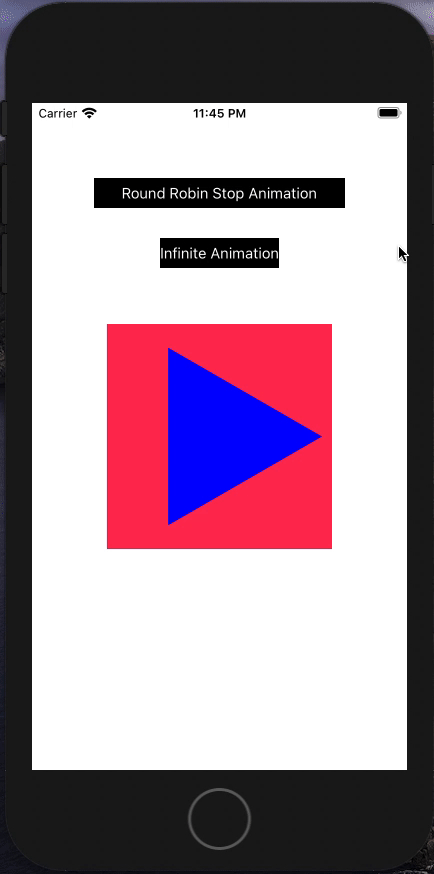

# SwiftyShapeChainAnimation

SwiftyShapeChainAnimation relies on power of UIKit core animation combined with path mathemagic.

Create geometric shapes and animate them seamlessly using simple interface.

## Example:

//Create Shape Array
`var shapes: [Shape] = [.triangle, .rectangle, .pentagon, .hexagon, .heptagon, .octagon, .nanogon, .decagon, .circle]`

//Create + Configure ChainShapeLayer
`let chainShapeLayer = ChainShapeLayer()`

//Assuming chainShapeLayer is part of the UIView root layer's hierarchy
`chainShapeLayer.chainAnimations(shapes: shapes, bShouldReturnToFirstState: false, bIsInfinite: true)`

or 

//Create Shape Array
`var shapes: [Shape] = [.triangle, .rectangle, .pentagon, .hexagon, .heptagon, .octagon, .nanogon, .decagon, .circle]`

//Create + Configure ChainShapeLayer
`let chainShapeLayer = ChainShapeLayer()`

//Assuming chainShapeLayer is part of the UIView root layer's hierarchy
`chainShapeLayer.chainAnimations(shapes: shapes, bShouldReturnToFirstState: true, bIsInfinite: false)`

## Live Demo:

## Extend:

Feel free to extend/modify `ChainShapeLayer.swift` to configure animation parameters including duration, media timing function and so on.